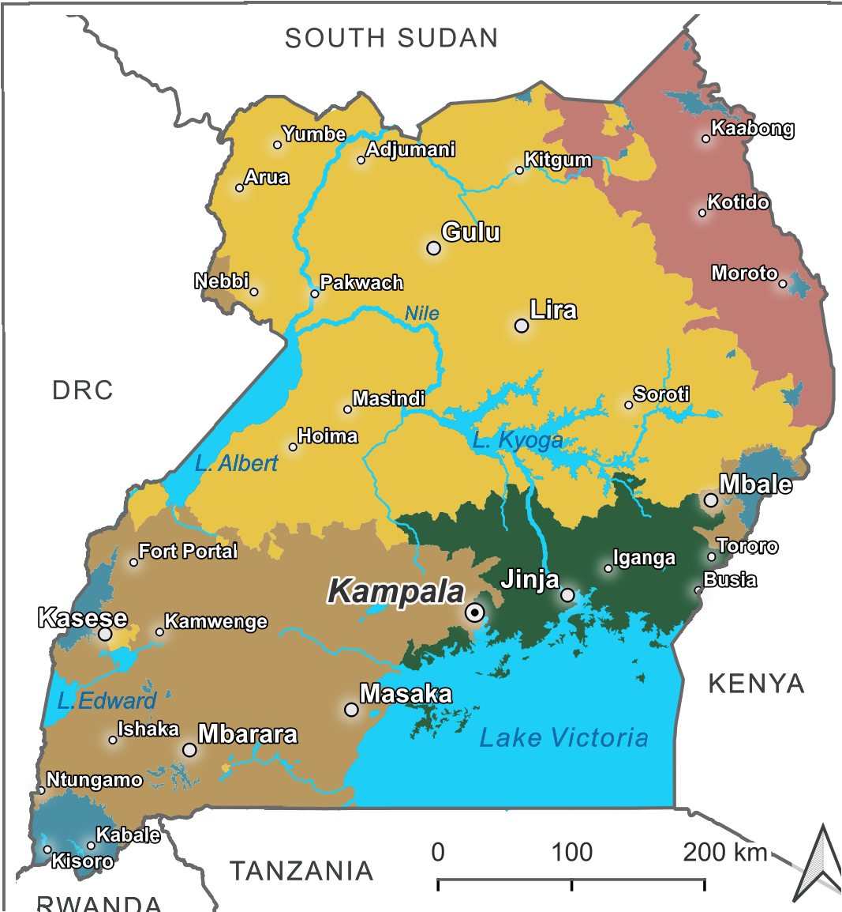
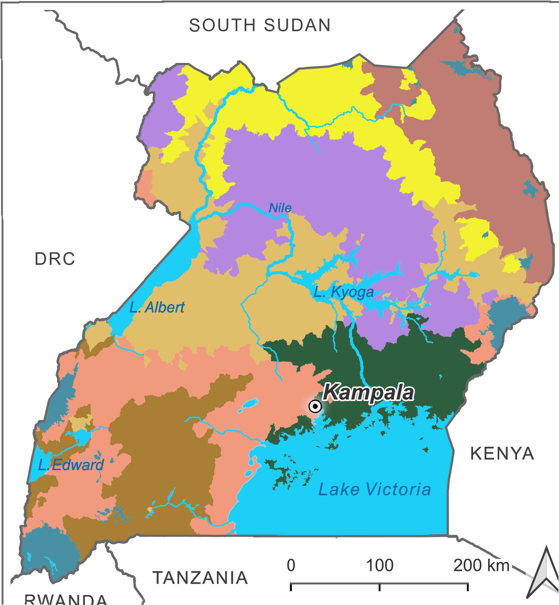
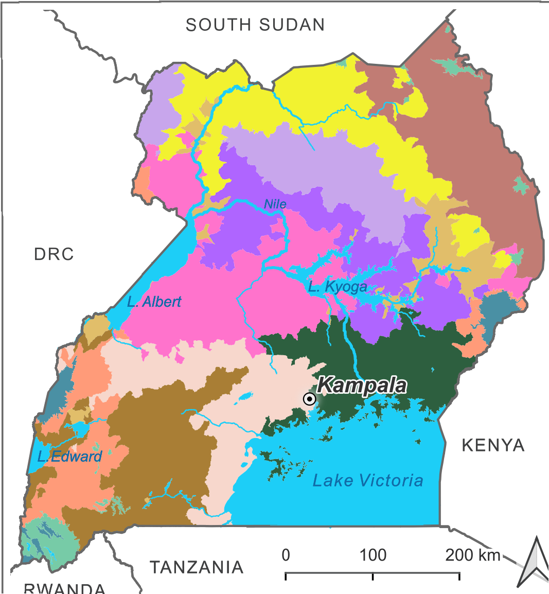
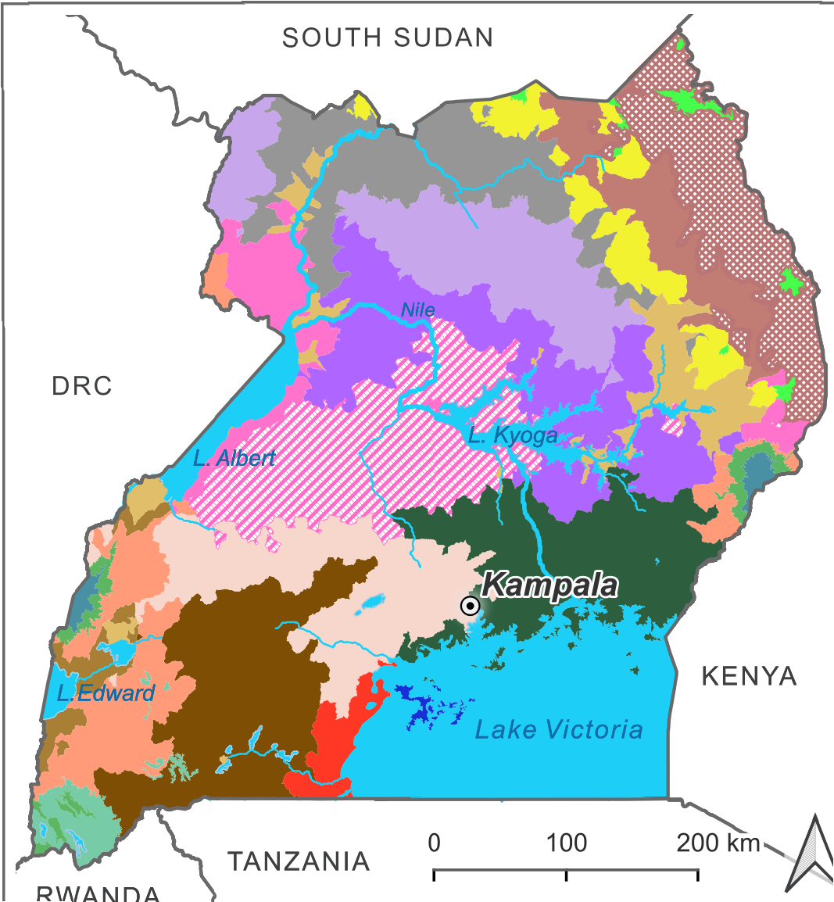

# Eco- and Bioregions of Uganda

An interactive web map of Uganda's hierarchical ecoregion / bioregion classification, built from the maps and data published in **Aine et al. (2026)**, *"Hierarchical eco-zone delineation in data-scarce Afrotropical river landscapes using global datasets"* (International Journal of Applied Earth Observation and Geoinformation).

**Live map:** https://herrnegger.github.io/Eco-and-Bioregions-of-Uganda/webmap/

> ### ⚠️ Note on this implementation
> This web map is a **fast, informal visualization tool**, put together quickly to make the published classification easy to browse, share, and check against GPS position in the field. Please refer to the paper (see [Citation](#citation--data) below) for more information.

## What this is

Four nested classification levels, each subdividing the one above it:

| Level | Units | Description |
|---|---|---|
| **Ecoregions (EcoR)** | 5 | Broadest tier — climatic and geographical influences, national-scale planning |
| **Bioregion Level I** | 8 (+ Lakes) | First subdivision — microclimate, topography, habitat differentiation |
| **Bioregion Level II** | 12 (+ Lakes) | Finer subdivision |
| **Bioregion Level III** | 20 (+ Lakes) | Finest tier — experimental, fine-scale abiotic subdivisions |

The framework was derived by unsupervised hierarchical clustering of climate, topography, and hydrology variables (WorldClim, SRTM, global surface water, Uganda wetlands data) at the scale of 2,174 HydroBASIN micro-watersheds, with cluster numbers chosen from silhouette/Jaccard stability analysis. Ecological coherence at each level was then validated bottom-up against Uganda's Potential Natural Vegetation (PNV) using random forest classification — predictive accuracy declined from a strong **80.35%** at the Ecoregion level to a weak **52.69%** at Bioregion Level III, meaning the two coarsest tiers (EcoR and BR I) are ecologically well-supported, while BR II and BR III are best treated as experimental, fine-scale subdivisions rather than validated ecological units.

### Naming convention

Hierarchical codes preserve lineage back to the parent ecoregion: a letter denotes the level (`A` = BR I, `B` = BR II, `C` = BR III) and a number denotes the subdivision order. For example, an area coded **A1B2C1 KDS** is the 1st BR-III subdivision of the 2nd BR-II subdivision of the 1st BR-I subdivision of the Karamoja Dry Steppe (KDS) ecoregion.

## The five ecoregions (EcoR)

| Code | Name | Area | Notes |
|---|---|---|---|
| **CNP** | Central-Northern Plains | 100,490 km² (41.7% of Uganda) | Lowest, gentlest terrain (mean elev. 881 masl); extends from Mt. Elgon's foothills to L. Albert and north to South Sudan/DRC. Annual rainfall ~1,268 mm. |
| **SSWL** | Southern Savanna-Woodland Landscapes | 54,677 km² | Southern Uganda west of L. Victoria, plus West Nile highlands and Mt. Elgon patches. Mean elevation 1,271 masl. Annual rainfall ~1,241 mm. |
| **KDS** | Karamoja Dry Steppe | 18,835 km² | Northeastern Uganda. Uganda's driest ecoregion (~874 mm/yr). Semi-arid thicket and bush steppe, dominated by Acacia-Commiphora bushland. |
| **VKWW** | Lake Victoria–Kyoga Wetland-Woodlands | 54,677 km² (22.7%) | Between Lakes Victoria and Kyoga, including all L. Victoria islands. Mean elevation 1,133 masl. |
| **MAR** | Montane-Alpine Ranges | 7,182 km² (3%) | Uganda's highest terrain (>1,700 masl): Rwenzori, Mt. Elgon, Southern Kigezi. Afromontane rainforest is the dominant, most ecologically distinctive vegetation. |

*(Area/elevation/climate figures as reported in Aine et al. 2026, Section 3.6.)*

## Maps

**Ecoregions**



**Bioregion Level I**



**Bioregion Level II**



**Bioregion Level III**



## The web map

Built with [Leaflet](https://leafletjs.com/), packaged as an installable offline-capable PWA:

- Switch between the four classification layers and adjust overlay opacity
- Switch basemap (Street / Satellite / Topographic / Light / Dark, all Esri — no API key needed)
- Show live GPS position (📍 button) for field orientation
- Collapsible legend matching the active layer, cropped from the original map exports
- ℹ️ info panel with this citation and disclaimer, always available in the app
- Installable to a phone home screen; previously visited map tiles are cached for offline use

## Citation & data

If you use the classification itself (not just this visualization tool), please cite:

> Aine, A., Graf, W., Stecher, G., Scharl, T., Ssanyu, G.A., Herrnegger, M. (2026). Hierarchical eco-zone delineation in data-scarce Afrotropical river landscapes using global datasets. *International Journal of Applied Earth Observation and Geoinformation*, 148, 105221. https://doi.org/10.1016/j.jag.2026.105221

Data set: Aine, A., Herrnegger, M., & Scharl, T. (2025). Hierarchical eco-zone delineation in data-scarce Afrotropical River landscapes using global datasets [Data set]. Zenodo. https://doi.org/10.5281/zenodo.17363432

Paper license: CC BY-NC-ND 4.0.

## Repository structure

```
eco_bioregions_geotiffs/   source GeoTIFFs (rendered map exports, one per level)
output/png/                 cropped/reprojected map layers + legend panels (generated)
webmap/                     the web map itself (index.html, manifest, service worker, vendor libs)
scripts/                    R build pipeline (see below)
```

## Rebuilding the map

Requires R with the `terra`, `png`, and `base64enc` packages.

```r
# 1. Crop/reproject each GeoTIFF to Uganda's extent + extract legend panels
Rscript scripts/build_layers.R

# 2. Generate PWA icons (only needed once, or if the source map changes significantly)
Rscript scripts/generate_icons.R

# 3. Inject Leaflet + all PNGs into webmap/index.html, stamp a fresh service worker
Rscript scripts/build_html.R
```

`webmap/index.html` is fully self-contained (Leaflet and all map/legend imagery are embedded as base64), so it can also be shared and opened directly as a standalone file — GPS location just won't work over `file://` on most mobile browsers, which is why it's also hosted on GitHub Pages.
