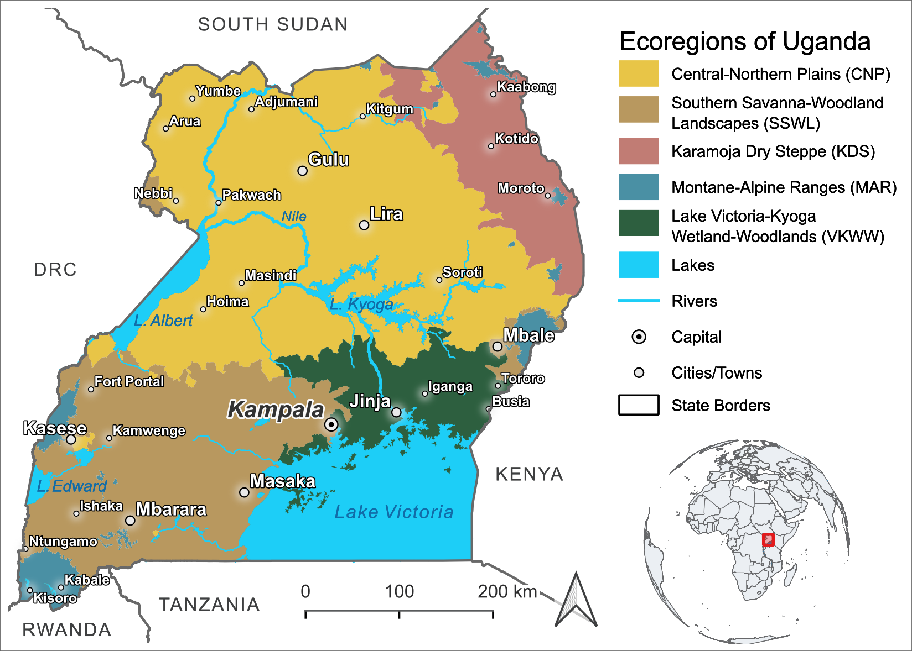
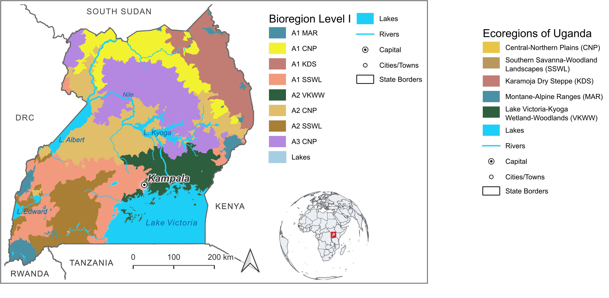
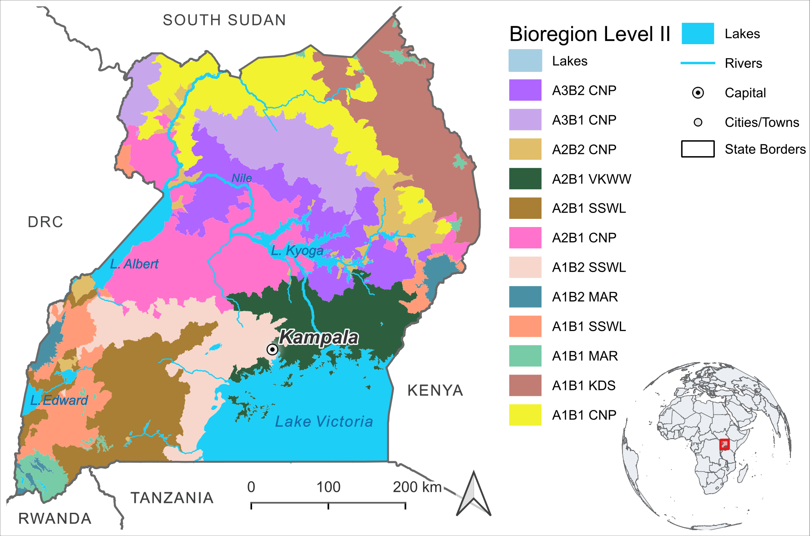
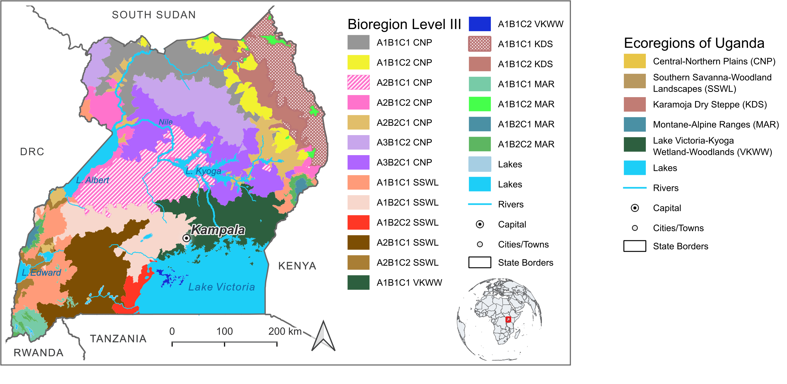

# Eco- and Bioregions of Uganda

An interactive web map of Uganda's hierarchical ecoregion / bioregion classification, built from the maps and data published in **Aine et al. (2026)**, *"Hierarchical eco-zone delineation in data-scarce Afrotropical river landscapes using global datasets"* (International Journal of Applied Earth Observation and Geoinformation).

**Live map:** https://herrnegger.github.io/Eco-and-Bioregions-of-Uganda/webmap-vector/

> ### About this map
> An interactive companion to the published classification — built for browsing, sharing, and checking against GPS position in the field. For citation or detailed analysis, please refer to the paper (see [Citation](#citation--data) below).
>
> The lines on the map are drawn precisely, but the ecology underneath them isn't: the classification comes from clustering continuous environmental gradients (climate, elevation, hydrology), so real transitions between neighboring zones are gradual, not the sharp edges a polygon boundary implies.

## What this is

Four nested classification levels, each subdividing the one above it:

| Level | Units | Description |
|---|---|---|
| **Ecoregions (EcoR)** | 5 | Broadest tier — climatic and geographical influences, national-scale planning |
| **Bioregion Level I** | 8 (+ Lakes) | First subdivision — microclimate, topography, habitat differentiation |
| **Bioregion Level II** | 12 (+ Lakes) | Finer subdivision |
| **Bioregion Level III** | 20 (+ Lakes) | Finest tier — experimental, fine-scale abiotic subdivisions |

The framework was derived by unsupervised hierarchical clustering of climate, topography, and hydrology variables (WorldClim, SRTM, global surface water, Uganda wetlands data) at the scale of 2,174 HydroBASIN micro-watersheds, with cluster numbers chosen from silhouette/Jaccard stability analysis. Ecological coherence at each level was then validated bottom-up against Uganda's Potential Natural Vegetation (PNV) using random forest classification — predictive accuracy declined from a strong **80.35%** at the Ecoregion level to a weak **52.69%** at Bioregion Level III, meaning the two coarsest tiers (EcoR and BR I) are ecologically well-supported, while BR II and BR III are best treated as experimental, fine-scale subdivisions rather than validated ecological units.

### Physio-geographical data used for the clustering

The classification is built entirely from **abiotic** (physio-geographical) variables — no biological data went into forming the clusters themselves; vegetation (PNV) was used only afterward, to validate how ecologically coherent the abiotic-based zones turned out to be. Of 20 candidate variables, 16 were retained (4 were dropped for being highly correlated with another, r ≥ 0.95), computed as zonal statistics over the 2,174 HydroBASIN micro-watersheds:

- **Climate** — WorldClim 2.1, 1970–2000 monthly normals, ~1 km resolution (Fick & Hijmans 2017; aridity/PET from Zomer et al. 2022): radiation range; annual temperature minimum and maximum; annual precipitation total; monthly precipitation mean, minimum, and maximum; total evapotranspiration; precipitation seasonality index; climatic water balance
- **Topography** — 30 arc-second SRTM elevation: mean and majority slope; mean elevation; elevation range
- **Hydrology / surface water** — Global Surface Water database (Pekel et al. 2016) and the Uganda Wetlands 2008 map: wetland proportion; lake presence/absence

These variables were fed into unsupervised hierarchical clustering (Euclidean distance, `hclust()`), with the four hierarchical cluster-count solutions (*k* = 5, 9, 13, 21 → Ecoregions, BR I, BR II, BR III) chosen from silhouette-width inflection points.

### Naming convention

Hierarchical codes preserve lineage back to the parent ecoregion: a letter denotes the level (`A` = BR I, `B` = BR II, `C` = BR III) and a number denotes the subdivision order. For example, an area coded **A1B2C1 KDS** is the 1st BR-III subdivision of the 2nd BR-II subdivision of the 1st BR-I subdivision of the Karamoja Dry Steppe (KDS) ecoregion.

## The five ecoregions (EcoR)

### CNP — Central-Northern Plains

100,490 km² (41.7% of Uganda's total area, 49.9% of its terrestrial area) — Uganda's largest ecoregion. Extends westward from Mount Elgon's foothills to Lake Albert's southern base, and north to South Sudan, DRC, and the Karamoja Dry Steppe. Gently sloping (average slope 1.9%) with Uganda's lowest mean elevation (881 ± 47 masl) and lowest point (614.4 masl, where the Nile exits into South Sudan). Receives 1,268 mm of rain annually with a fairly short dry season. Dominant vegetation: Butyrospermum wooded grasslands and Moist Combretum wooded grasslands, with smaller patches of Terminalia woodland, lowland bamboo, and palm wooded grasslands.

### SSWL — Southern Savanna-Woodland Landscapes

54,677 km², mainly in southern Uganda west of Lake Victoria, with smaller disjunct portions in the West Nile highlands and around Mount Elgon. Average elevation 1,271 masl (range 621–1,926 masl), average slope 5.2%. Receives 1,241 mm of rain annually; classified as arid (aridity index 0.07). Dominant vegetation: Evergreen and semi-evergreen bushland and thicket, alongside edaphic grassland on seasonally flooded soils, palm wooded grassland, and dry Combretum wooded grassland.

### KDS — Karamoja Dry Steppe

18,835 km² in northeastern Uganda, with plains averaging 3.05% slope and elevations from 919–1,796 masl. Uganda's driest ecoregion, receiving only 874 mm of rain annually with a short dry season. Geology is dominated by metamorphic rock, supporting semi-arid thicket and bush steppe. Dominant vegetation: Somalia-Masai Acacia-Commiphora deciduous bushland and thicket — the single strongest vegetation association found anywhere in the study (indicator value 0.640). Other significant types include dry Combretum wooded grasslands and riverine wooded vegetation.

### VKWW — Lake Victoria-Kyoga Wetland-Woodlands

54,677 km² (22.7% of Uganda), lying between Lakes Victoria and Kyoga and including all Lake Victoria islands, extending north to just below Lake Kyoga. Bordered by Mount Elgon to the east, SSWL to the west, and CNP to the north. Mean elevation 1,133 ± 26 masl, average slope 2.4%. Dominant vegetation: semi-evergreen Guineo-Congolian rainforest along Lake Victoria's drier periphery, with a mean canopy height of 5.2 ± 8.4 m.

### MAR — Montane-Alpine Ranges

7,182 km² (3% of Uganda's terrestrial area) — the smallest and highest ecoregion, covering all areas above 1,700 masl. Predominant in the highlands of Southern Kigezi, Mt. Rwenzori, and Mt. Elgon, with small patches in Karamoja. Geologically heterogeneous (volcanic rock on Mt. Elgon, metamorphic in Kigezi/Rwenzori/Karamoja). Dominant vegetation: Afromontane rainforest, the most ecologically distinctive vegetation type found in the study (indicator value 0.63), along with Afroalpine vegetation, Afromontane bamboo, the Montane Ericaceous belt, and Hagenia abyssinica forest.

*(Descriptions and figures as reported in Aine et al. 2026, Section 3.6.)*

## Maps

**Ecoregions**



**Bioregion Level I**



**Bioregion Level II**



**Bioregion Level III**



## The web map

Built with [Leaflet](https://leafletjs.com/) on real vector polygons (not static images), packaged as an installable offline-capable PWA:

- Switch between the four classification layers and adjust overlay opacity
- Click any region for its area, share of Uganda, mean elevation, and mean annual precipitation (area-weighted zonal statistics computed from WorldClim, not the shapefiles' own attribute table — see [Repository structure](#repository-structure))
- Switch **Display** to color regions by elevation or precipitation instead of category, using natural-breaks classification
- Switch basemap (Street / Satellite / Topographic / Light / Dark, all Esri — no API key needed)
- Show live GPS position (📍 button) for field orientation
- Collapsible legend matching the active layer and display mode
- ℹ️ info panel with citation and background, always available in the app
- Installable to a phone home screen; the app shell and previously visited map tiles are cached for offline use

A lighter, image-based version (no click-for-stats, but a smaller download) is also available at [`webmap/`](webmap/).

## Citation & data

If you use the classification itself (not just this visualization tool), please cite:

> Aine, A., Graf, W., Stecher, G., Scharl, T., Ssanyu, G.A., Herrnegger, M. (2026). Hierarchical eco-zone delineation in data-scarce Afrotropical river landscapes using global datasets. *International Journal of Applied Earth Observation and Geoinformation*, 148, 105221. https://doi.org/10.1016/j.jag.2026.105221

Data set: Aine, A., Herrnegger, M., & Scharl, T. (2025). Hierarchical eco-zone delineation in data-scarce Afrotropical River landscapes using global datasets [Data set]. Zenodo. https://doi.org/10.5281/zenodo.17363432

Paper license: CC BY-NC-ND 4.0.

## Repository structure

```
eco_bioregions_geotiffs/   source GeoTIFFs (rendered map exports, one per level)
output/png/                 cropped/reprojected map layers + legend panels (generated)
webmap/                      the image-based web map (index.html, manifest, service worker, vendor libs)
webmap-vector/                the primary, vector-based web map (same structure, plus data/*.geojson)
scripts/                    R build pipeline (see below)
```

The vector map's polygons and statistics come from shapefiles and WorldClim rasters that live outside this repo (paths hardcoded at the top of `scripts/build_vector_layers.R` and `scripts/compute_zonal_stats.R`) — not needed to just view or redeploy the built site, only to regenerate `webmap-vector/data/*.geojson` from scratch.

## Rebuilding the map

Requires R with the `terra`, `sf`, `classInt`, `colorspace`, `png`, and `base64enc` packages.

```r
# Image-based map (webmap/):
Rscript scripts/build_layers.R        # crop/reproject each GeoTIFF + extract legend panels
Rscript scripts/generate_icons.R      # PWA icons (once, or if the source map changes significantly)
Rscript scripts/build_html.R          # inject Leaflet + PNGs into webmap/index.html, stamp service worker

# Vector map (webmap-vector/):
Rscript scripts/build_vector_layers.R # derive names/stats/colors, clip lakes, export GeoJSON
Rscript scripts/build_vector_html.R   # inject Leaflet + GeoJSON into webmap-vector/index.html, stamp service worker
```

Both `index.html` files are fully self-contained (Leaflet and all map data are embedded directly, as base64 images or inline GeoJSON), so either can also be shared and opened directly as a standalone file — GPS location just won't work over `file://` on most mobile browsers, which is why they're also hosted on GitHub Pages.
